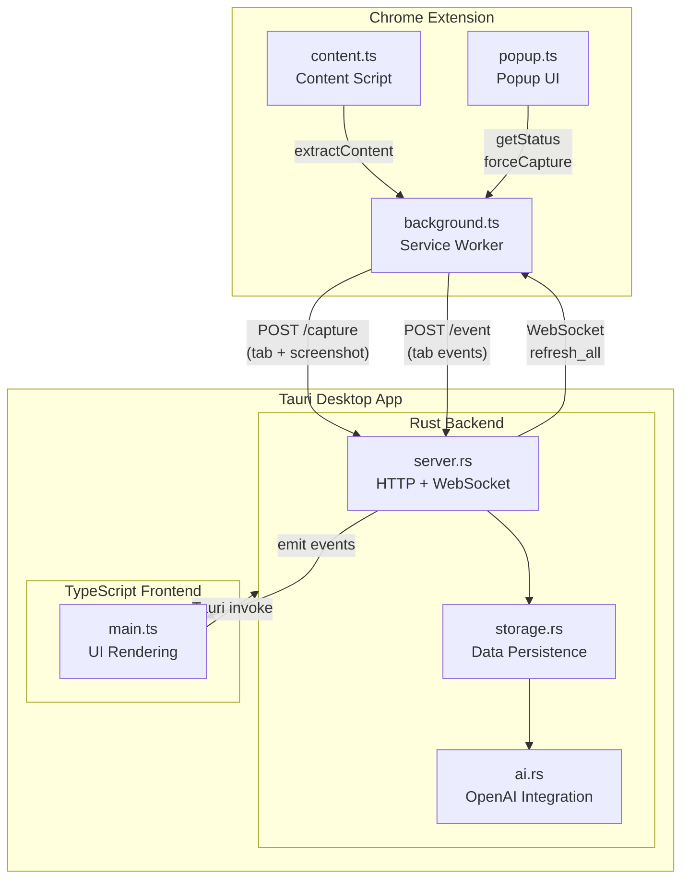

# Tab Cleanser

AI-powered Chrome tab cleanup and daily browsing reports.

## Architecture

```
tab_cleanser/
├── extension/     # Chrome Extension (lightweight data collector)
│   └── src/
│       ├── background.ts     # Main service worker
│       ├── content.ts        # Content script for text extraction
│       ├── popup.ts          # Popup UI
│       └── modules/          # Modular components
│           ├── types.ts      # Type definitions
│           ├── config.ts     # Configuration constants
│           ├── state.ts      # State management
│           ├── server.ts     # HTTP communication
│           ├── screenshot.ts # Screenshot capture
│           ├── timer.ts      # Active time tracking
│           ├── handlers.ts   # Tab event handlers
│           ├── websocket.ts  # WebSocket connection
│           └── sync.ts       # Tab synchronization
│
└── desktop/       # Tauri Desktop App (AI analysis + UI)
    ├── src/                  # TypeScript frontend
    │   ├── main.ts           # Entry point
    │   ├── types.ts          # Type definitions
    │   ├── state.ts          # Application state
    │   ├── api.ts            # Tauri API wrapper
    │   ├── utils.ts          # Utility functions
    │   ├── views/            # View components
    │   └── components/       # UI components
    │
    └── src-tauri/src/        # Rust backend
        ├── main.rs           # Tauri commands
        ├── server.rs         # HTTP + WebSocket server
        ├── storage.rs        # Data persistence
        └── ai.rs             # OpenAI integration
```

## System Data Flow



### Core Data Flow

1. **Tab Event Capture**: Extension monitors `tabs.onCreated/Updated/Activated/Removed`
2. **Screenshot Capture**: Auto-captures after user stays on tab for 3+ seconds
3. **Data Sync**: HTTP POST to Desktop App (port 21890)
4. **AI Analysis**: Desktop calls OpenAI API to analyze tabs
5. **Bidirectional Communication**: WebSocket for Desktop → Extension commands

## API Endpoints

The desktop app exposes a local HTTP server on port `21890`:

| Endpoint | Method | Description |
|----------|--------|-------------|
| `/health` | GET | Health check |
| `/capture` | POST | Receive tab capture with screenshot |
| `/event` | POST | Receive tab events (created, updated, activated, removed) |
| `/screenshot/:filename` | GET | Serve screenshot images |
| `/ws` | WebSocket | Bidirectional communication |

## Prerequisites

- Node.js 18+
- Rust (for Tauri): https://www.rust-lang.org/tools/install
- Tauri prerequisites: https://tauri.app/v1/guides/getting-started/prerequisites

## Quick Start

### 1. Build the Chrome Extension

```bash
cd extension
npm install
npm run build
```

Then load `extension/dist` as an unpacked extension in Chrome:
- Go to `chrome://extensions`
- Enable "Developer mode"
- Click "Load unpacked"
- Select the `extension/dist` folder

### 2. Build and Run the Desktop App

```bash
cd desktop
npm install
npm run tauri dev
```

For production build:
```bash
npm run tauri build
```

## Configuration

1. Open the desktop app
2. Go to Settings
3. Enter your OpenAI API key
4. (Optional) Set a custom Base URL for API proxy
5. (Optional) Add your work context to improve AI decisions
6. Save settings

## Usage

1. Browse the web normally - the extension tracks your tabs
2. Open the desktop app to see tracked tabs with screenshots
3. Click "Analyze with AI" to get keep/close suggestions
4. Click "Generate Report" for a daily activity summary
5. Use Keep/Close buttons to manage individual tabs

## Features

- **Smart Tab Tracking**: Monitors tab activity, including time spent and last active timestamp
- **Automatic Screenshots**: Captures tab screenshots when you stay on a tab for 3+ seconds
- **AI-Powered Analysis**: Uses OpenAI to categorize tabs and suggest which to keep/close
- **Daily Reports**: Generates AI summaries of your browsing activity
- **Context-Aware**: Customize AI behavior with your work context and preferences
- **History View**: See tabs closed today for daily report generation

## Ports

- Extension sends data to `http://localhost:21890`
- Desktop app frontend runs on `http://localhost:5173` (dev mode)

## Integration with Chrome Control MCP

Tab Cleanser can work alongside the [Chrome Control MCP Extension](https://github.com/anthropic/chrome-control) for Claude Desktop. While Tab Cleanser analyzes and suggests tabs to close, Chrome Control allows Claude to actually execute browser actions like closing tabs.

## License

MIT
